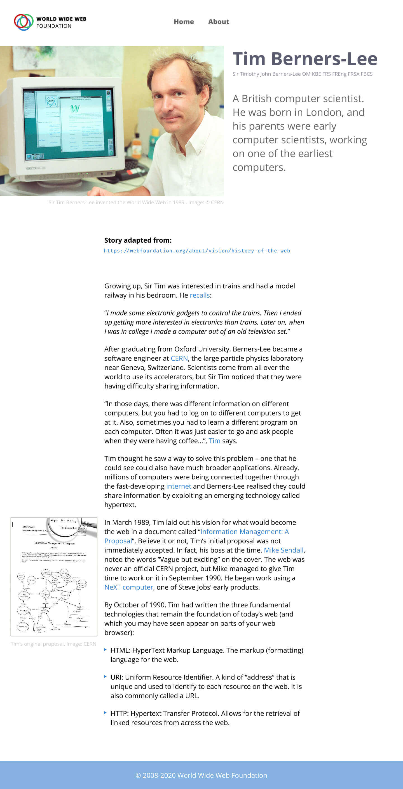

# Project UI/UX Design

Let's learn some basic UI/UX design.

Use Figma to create something like this:

Access the original assets on Figma:

- Design: https://figma.com/file/NmDfZ5bcoMvOAGMoOVPO9y
- Prototype: https://figma.com/proto/NmDfZ5bcoMvOAGMoOVPO9y
